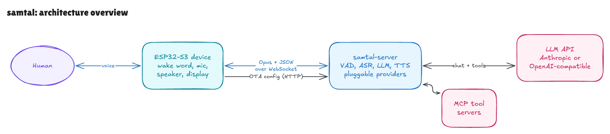

<div align="center">


# vinga 💬

**vinga** *(interj.)* Catalan for "*come on, let's go*".<br>
Come on, speak, on your own terms.

Conversational AI. [Sweded](https://youtu.be/i5Rd8x4OJoY).

[](https://github.com/rafacm/vinga/actions/workflows/vinga-server.yml)
[](https://www.python.org/)
[](https://fastapi.tiangolo.com/)
[](https://docs.espressif.com/projects/esp-idf/en/latest/esp32s3/)
[](LICENSE)

[What is it?](#what-is-vinga) • [Features](#features) • [Hardware](#hardware) • [Getting Started](#getting-started) • [Project Layout](#project-layout) • [Credits](#credits) • [Changelog](#changelog)

</div>

> [!WARNING]
> **Early development.** This README describes the intended v1. Sections marked 🚧 are not implemented yet. The foundation has been validated end-to-end: a Waveshare ESP32-S3 device talking to a self-hosted Python server with a fully local pipeline (wake word, speech recognition, LLM, speech synthesis), currently using the upstream xiaozhi firmware and server it builds on; the vinga code around it is new.

## What is vinga?

> You take what you like and mix it with some other things you like and make a new thing. *Your* thing!<br>
> -- from the movie [Be Kind Rewind (2008)](https://youtu.be/i5Rd8x4OJoY)

We took two projects we liked, the [78/xiaozhi-esp32](https://github.com/78/xiaozhi-esp32) firmware and the [xinnan-tech/xiaozhi-esp32-server](https://github.com/xinnan-tech/xiaozhi-esp32-server) conversation server, and some devices we also liked, the small [Waveshare ESP32-S3 boards](#hardware) that put a microphone, a speaker, and a display on your desk. We reimplemented what we wanted to make our own (the **conversation server**, rebuilt in Python you run yourself), kept what was already excellent (the firmware's board support, audio pipeline, and device protocol), and mixed in the things *you* like.

The new thing is a self-hostable voice agent where the device talks to **your server** and nothing else. Every stage is a **pluggable provider**: bring your own LLM (a local [Ollama](https://ollama.com), Anthropic, or any OpenAI-compatible endpoint), your own voices, and your own tools via [MCP](https://modelcontextprotocol.io). The whole loop (wake word → speech recognition → language model → speech synthesis) can run entirely on your own hardware, and wherever you choose a cloud provider instead, it is exactly that, your choice: your keys, through your server, swappable at will. No vendor cloud, no account, no activation. Your thing.



That is the whole picture at a glance; one conversation turn in full detail, from wake word to spoken reply, is diagrammed and explained step by step in [docs/architecture](docs/architecture/README.md).

## Features

The design premise is a **thin device and a smart server**: the firmware's only tie to a backend is a single config URL, and everything else (endpoints, credentials, even firmware updates) is delivered by *your* server at runtime. Customization lives server-side, in Python, not in C++ you have to reflash.

- **Self-hosted end to end.** The device speaks Opus over a WebSocket to your server and nothing else. Run it on a laptop or ship the published multi-arch container image to your own infrastructure. WebSocket is the only transport for v1; upstream's MQTT+UDP alternative may follow.
- **No account, no activation, no phone app.** Point the device at your server once; it connects and talks.
- **Pluggable LLM.** Fully local via [Ollama](https://ollama.com), or Anthropic and any OpenAI-compatible endpoint. 🚧
- **Pluggable voice.** Speech recognition and synthesis are swappable providers; a zero-API-key local pipeline (Silero VAD + faster-whisper + Piper) works today, and the cloud is there for either half when you would rather have the better voice, or the ear that copes with a noisy room in your own language, than the private one.
- **Tools via MCP, on both sides.** Attach any MCP server as assistant tools; the device itself exposes its controls (volume, brightness, screen) as MCP tools over the same channel.
- **Compiler-grade upstream, thin fork.** Device support, audio pipeline, and echo cancellation come from the actively maintained [xiaozhi-esp32](https://github.com/78/xiaozhi-esp32) project; vinga changes as little as possible on the device. 🚧
- **Speech in, speech out, everything visible.** Recognized text and responses render on the device display as the conversation happens.

## Hardware

Any board supported by xiaozhi-esp32 can work; these are the ones vinga targets and tests:

| Board | Display | Audio | Links | Status |
| --- | --- | --- | --- | --- |
| [Waveshare ESP32-S3-ePaper-1.54](https://www.waveshare.com/esp32-s3-epaper-1.54.htm) | 200×200 e-paper | single mic | [guide](docs/devices/waveshare-esp32-s3-epaper-1.54.md) · [wiki](https://docs.waveshare.com/ESP32-S3-ePaper-1.54) | planned 🚧 |
| [Waveshare ESP32-S3-Touch-LCD-1.54](https://www.waveshare.com/esp32-s3-lcd-1.54.htm) | 240×240 LCD, touch | dual-mic with hardware echo cancellation | [guide](docs/devices/waveshare-esp32-s3-touch-lcd-1.54.md) · [wiki](https://docs.waveshare.com/ESP32-S3-Touch-LCD-1.54) | [**working** (upstream firmware)](docs/devices/waveshare-esp32-s3-touch-lcd-1.54.md) |
| [Waveshare ESP32-S3-Touch-AMOLED-2.16](https://www.waveshare.com/esp32-s3-touch-amoled-2.16.htm) | 480×480 AMOLED, touch | dual-mic with hardware echo cancellation | [guide](docs/devices/waveshare-esp32-s3-touch-amoled-2.16.md) · [wiki](https://docs.waveshare.com/ESP32-S3-Touch-AMOLED-2.16) | planned 🚧 |

## Getting Started

The device runs upstream's prebuilt xiaozhi firmware; the server is vinga's, and ships as a container image.

**1. Write the server half.** One YAML file says how the process runs. A trial needs almost nothing in it:

```yaml
server:
  # A trial on a network you trust. Leave it out for anything that
  # outlives an afternoon: authentication is on by default.
  auth:
    enabled: false
```

Start from [`vinga-server/config.example.yaml`](vinga-server/config.example.yaml), which documents every key of it, or from [`vinga-server/config.deploy.example.yaml`](vinga-server/config.deploy.example.yaml), a ready-to-adapt profile for the container image behind a proxy on a small CPU quota, whose domain half is the runnable [`config.deploy.example.sh`](vinga-server/config.deploy.example.sh) beside it.

**2. Start the server.** An empty database is a valid state to start on: the server comes up serving no agents, and the next step configures it over the API it serves. Generate the secrets **once** and keep them somewhere you can read them back:

```bash
openssl rand -hex 32 > ~/.vinga-api-secret       # once, ever
openssl rand -hex 32 > ~/.vinga-auth-secret      # once, ever

export VINGA_API_SECRET=$(cat ~/.vinga-api-secret)
export VINGA_AUTH_SECRET=$(cat ~/.vinga-auth-secret)
docker run -d --name vinga -p 8003:8003 \
  -e VINGA_API_SECRET \
  -e VINGA_AUTH_SECRET \
  -v /path/to/config.yaml:/config/config.yaml:ro \
  -v vinga-data:/data \
  ghcr.io/rafacm/vinga-server:latest
```

`VINGA_API_SECRET` is the bearer token for the configuration API the next step writes through; it is always required, and the server refuses to start without it. `VINGA_AUTH_SECRET` signs the device tokens and is required whenever device authentication is on, which it is by default and which the trial file above turns off.

Generating either one inline in the `docker run` would mint a new secret on every restart. For the device secret that is worse than inconvenient: each new one invalidates the token every device has stored, and a device that has one is then refused until its next OTA check, which it only makes on boot, so it sits there playing an error tone at you.

This start is quick: with nothing configured there is no engine to build. Speech models download into the `/data` volume when the providers naming them are first built, which is the apply in step 4, so that one takes a few minutes and later ones take seconds.

**3. Say what the assistant is.** The other half of the configuration (which engines, which agents, which devices) lives in a database on the data volume, written with `vinga-server config`, the CLI the image ships. It writes through the configuration API on the running server, so run it inside the container, where the token and the loopback address are already in its environment. This assistant is fully local and needs no account anywhere: Silero, faster-whisper, [Ollama](https://ollama.com) and Piper.

```bash
# The CLI, inside the container started above.
vinga() { docker exec -i vinga vinga-server "$@"; }

vinga config set provider vad ears -f - <<'YAML'
type: silero
YAML

vinga config set provider asr whisper -f - <<'YAML'
type: faster_whisper
model: small
YAML

vinga config set provider llm local -f - <<'YAML'
type: openai_compatible
# Ollama on the host. On Linux, add
# --add-host=host.docker.internal:host-gateway to the docker run in
# step 2.
base_url: http://host.docker.internal:11434/v1
model: qwen3:8b
YAML

vinga config set provider tts voice -f - <<'YAML'
type: piper
voice: en_US-lessac-medium
YAML

vinga config set agent-defaults -f - <<'YAML'
llm: local
asr: whisper
tts: voice
vad: ears
YAML

vinga config set agent assistant -f - <<'YAML'
prompt: >
  You are a helpful voice assistant. Keep replies short, plain and
  speakable, and always reply in the language the user spoke.
YAML

# Which agent an unknown device reaches. Bind specific devices instead
# with: vinga config bind-device aa:bb:cc:dd:ee:ff assistant
vinga config set-default-agent assistant

vinga config list
```

The order matters: a write whose references do not resolve is refused, so the providers come first and the agent that names them second. Every field is documented in [`docs/reference/domain-config.md`](docs/reference/domain-config.md), generated from the models, and [`vinga-server/examples/`](vinga-server/examples/) holds a commented fragment per entity and provider type to copy from, cloud engines included. A credential is never written into a fragment: it names the environment variable holding it, or is stored encrypted with `config set-secret` under a `VINGA_MASTER_KEY` you generate once and keep.

From outside the container instead, name the API with `--api-url` (or `VINGA_API_URL`) and carry the token yourself, over TLS or a tunnel that terminates it: the client refuses a plain `http://` connection to a host that is not a loopback address. [The configuration API](vinga-server/README.md#the-configuration-api) in the server README has the whole surface, and [`docs/reference/api-openapi.json`](docs/reference/api-openapi.json) is the contract for anything that writes this configuration without a person typing it.

**4. Apply it.** A write is stored and is not in effect when the command returns, which is why the writes above each said what they were waiting for. This is that: the server re-reads the whole stored half, builds the engines it names and serves them, without a restart and without dropping a conversation. Every later change to this half is applied the same way; a device binding is the one thing that needs no step at all, since a running server reads those as a device asks.

```bash
vinga config reload
```

**5. Flash** the prebuilt xiaozhi merged binary for your board at offset `0x0`.

**6. Ask for the URL to type**, and check that something sensible answers on it. No cable is involved in either. The URL is derived from the device-auth secret you generated in step 2, so `ota-url` reaches nothing to answer and the string is the same at every start.

```bash
vinga config ota-url     # http://192.168.1.10:8003/x/AB2C4D5E/
vinga config doctor      # says what a device would be told, or what is wrong
```

Eight characters, in an alphabet with no `0`/`O` and no `1`/`I`/`l`, because this string gets typed on a phone off a small display. If the origin was guessed rather than configured, the command says so: set `server.public_url` to name the deployment exactly.

**7. Provision WiFi** from the device's captive portal, putting that URL in the portal's advanced section as the server address. Which button brings the portal up depends on the board (PWR on the Touch-LCD-1.54, BOOT on the others), so start from your board's guide in [`docs/devices/`](docs/devices/README.md), which also covers its wake word, its display, and the rest of its controls.

**8. Bind the board.** Step 3 set a `default_agent`, so any board that reaches the server is already covered and this one starts talking as soon as it connects: press the button and talk. Leave `default_agent` unset instead and the `devices` map becomes an allowlist, where an unbound board is answered with a six-digit activation code it shows and speaks, and one command binds it:

```bash
vinga config pending                       # which board is showing what
vinga config add-device 418293 assistant   # bind the one showing 418293
```

The device polls while it waits, so it connects seconds later with no restart and no power cycle. `bind-device` is the same write for a MAC you already know; `add-device` is for the board in front of you. A board provisioned earlier with a full `ota_url` in NVS keeps reaching the server exactly as before.

The complete procedure, including a fully local zero-API-key pipeline and every serial gotcha, is in [`docs/xiaozhi-notes.md`](docs/xiaozhi-notes.md); the server's own options, security defaults, and container details are in [`vinga-server/README.md`](vinga-server/README.md). vinga has no versioned releases yet: images are tagged `latest`, the build time (`2026-08-03-1200`, UTC), and the commit SHA (`sha-3f9362a`). Only `latest` moves; deploy from one of the other two.

## Project Layout

| Directory | What it is |
| --- | --- |
| [`vinga-server/`](vinga-server/) | The conversation server (Python): OTA/config endpoint, WebSocket audio channel, VAD → ASR → LLM → TTS pipeline with pluggable providers, MCP tools, device authentication. Published as a multi-arch container image. |
| [`vinga-esp32/`](vinga-esp32/) | Thin firmware customization: vinga server as default endpoint, English wake word, minimal UI changes. 🚧 |
| [`docs/`](docs/README.md) | Research notes on the upstream architecture and the device↔server protocol, plus the plans and implementation notes behind each milestone. |
| `vendor/` | Reference clones of the upstream projects (not committed). |

## Credits

vinga is assembled on top of two MIT-licensed projects, and would be nothing without them:

- [**78/xiaozhi-esp32**](https://github.com/78/xiaozhi-esp32) provides the ESP32 firmware: board support, audio pipeline, wake word, display UI, and the device↔server protocol.
- [**xinnan-tech/xiaozhi-esp32-server**](https://github.com/xinnan-tech/xiaozhi-esp32-server) is the Python conversation server vinga starts from.

License notices are preserved in [THIRD_PARTY_LICENSES.md](THIRD_PARTY_LICENSES.md).

The word *sweded*, and the whole idea of remaking something you love with your own hands, comes from the film *Be Kind Rewind* (2008); its creators explain [How To Swede](https://youtu.be/i5Rd8x4OJoY) on YouTube.

## Changelog

Notable changes are recorded in [CHANGELOG.md](CHANGELOG.md), following the [Keep a Changelog](https://keepachangelog.com/en/1.1.0/) format with dated sections.

## License

Released under the [MIT License](LICENSE). Copyright (c) 2026 Rafael Cordones.
